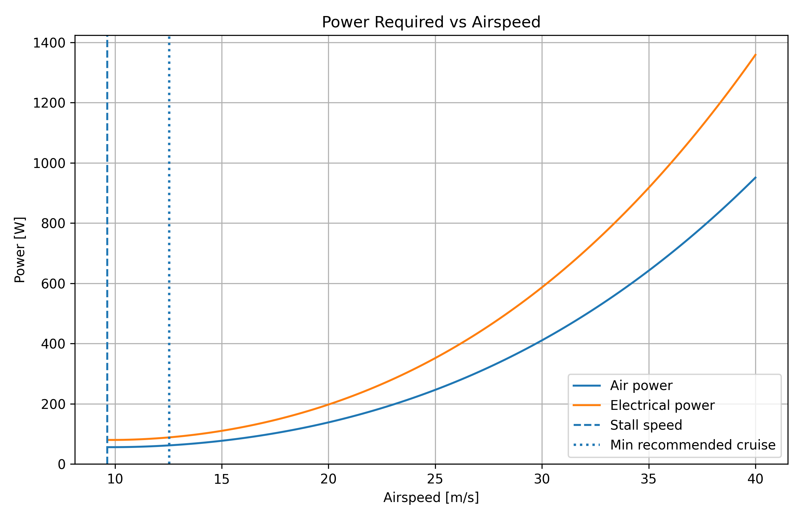
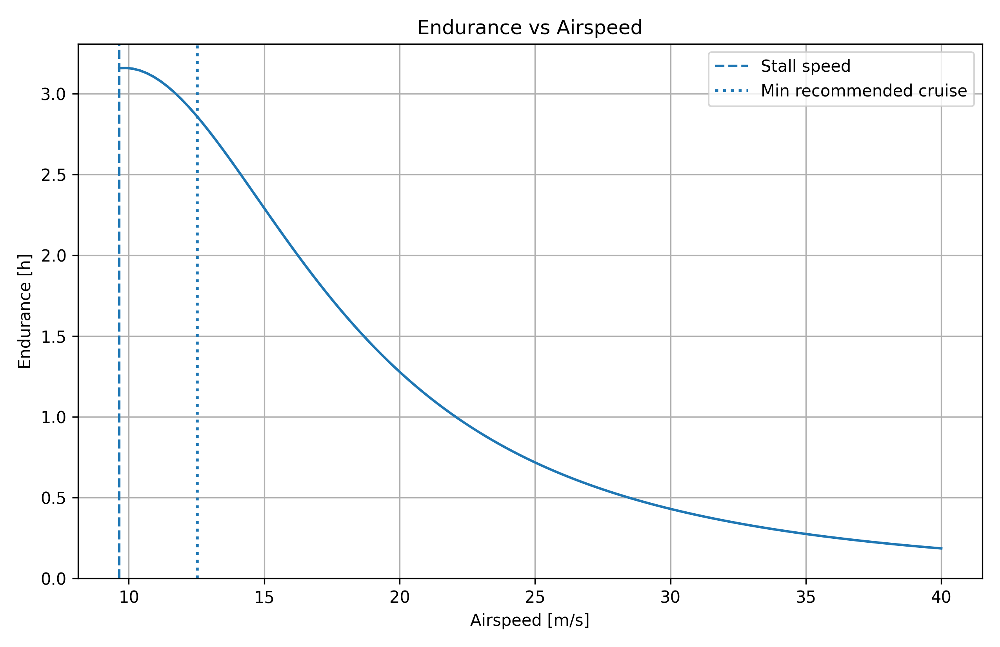
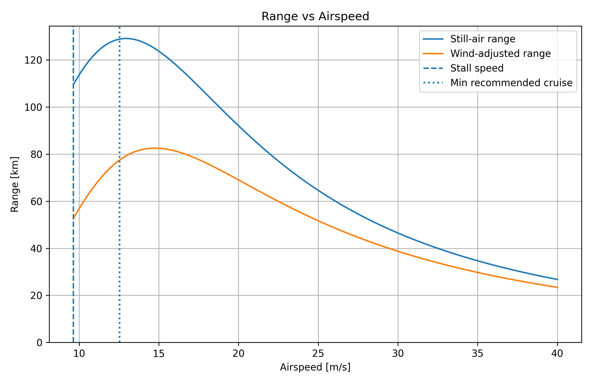
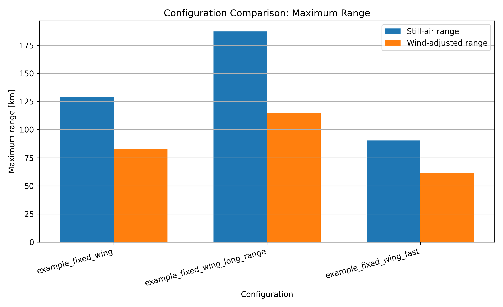
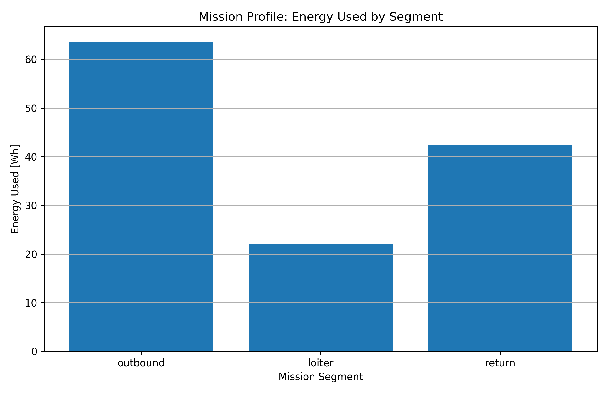
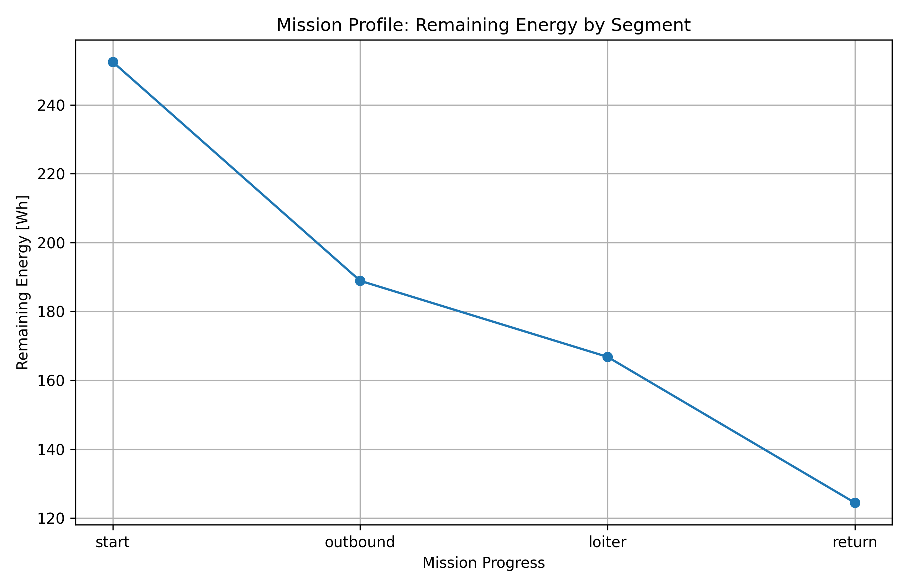

# UAV Mission Performance Estimator

A Python-based engineering tool for estimating fixed-wing UAV performance and mission-profile behaviour from preliminary design inputs.

The tool uses inputs such as mass, payload, battery characteristics, aerodynamic assumptions, propulsion efficiency, cruise speed, wind, and altitude to estimate:

- power required
- endurance
- range
- speed-performance trade-offs
- configuration comparisons
- mission feasibility
- segmented mission-profile performance
- mission scenario comparisons

## Current Features

- fixed-wing steady level-flight performance model
- stall speed and minimum recommended cruise speed
- drag, power, endurance, and range calculations
- airspeed sweep analysis
- best-endurance and best-range operating point selection
- comparison of multiple UAV configurations
- mission feasibility assessment at chosen cruise speed
- config-driven segmented mission profiles
- outbound / loiter / return mission evaluation
- mission profile energy tracking by segment
- ISA atmosphere support using altitude-based density
- mission scenario comparison across multiple YAML cases
- CSV export of sweep, comparison, and mission-profile results
- automatic plot generation
- automated test coverage with `pytest`

## Example Outputs

### Power vs Airspeed


### Endurance vs Airspeed


### Range vs Airspeed


### Configuration Comparison


## Version 2 Enhancements

Version 2 extends the tool beyond single-point performance estimation into mission-profile and scenario analysis.

New capabilities include:

- reusable best-endurance, best-range, and best wind-adjusted range operating point selection
- segmented mission profile evaluation for outbound, loiter, and return phases
- mission profile energy usage and remaining-energy tracking by segment
- mission profile CSV export
- mission profile plot generation
- ISA atmosphere support using altitude-based density estimation
- config-driven mission profile definition in YAML
- command-line config selection
- comparison of multiple mission scenarios

### Mission Profile Outputs

#### Mission Energy by Segment


#### Remaining Energy by Segment


## How to Run

Run the tool with a selected config file:

```powershell
py -m uav_mpe.main --config configs/example_fixed_wing.yaml